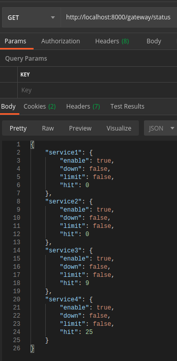

# Semart Api Gateway

Semart Api Gateway is Fast, Simple Yet Powerful API Gateway base on Symfony Component that aim to simplify your day

If you want to get more feature that we don't provide, just use [Kong](https://github.com/kong/kong)

## Requirements

>
> * PHP >= 7.2
>
> * Redis
>
> * Elasticsearch 7.X
>
> * PHP Redis Extension
>

## Workflow


## Super Fast


>
> Screenshot use [SemartApiSkeleton](https://github.com/KejawenLab/SemartApiSkeleton) demo on my Digital Ocean VPS with 1 GB of RAM
>

## Install

```bash
git clone https://github.com/KejawenLab/SemartApiGateway.git gateway
cd gateway
cp .env.example .env
cp gateway.yaml.example gateway.yaml
cp routes.yaml.example routes.yaml
cp services.yaml.example services.yaml
cp aggregates.yaml.example aggregates.yaml
composer update
php gateway create-index
php -S localhost:8000 -t public/
```

## Configuration

Please Check [Main Configuration Example](gateway.yaml.example), [Service Configuration Example](services.yaml.example) and [Routes Configuration Example](routes.yaml.example)

## Statistic

You can see statistic by call path `/gateway/statistic` and the response be like


## Services Status

You can see statistic by call path `/gateway/status` and the response be like



## Health Check

Add to crontab

```bash
* * * * * php gateway health-check > /dev/null
```

## Features

* Easy to Install and Configure

* Api Versioning

* Public and Private Api

* Aggregate Query

* Load Balancer

* Response Cache

* Authentication Using JWT

* Resource Limiter

* Request Limiter

* Request Timeout

* Health Check

* Statistic

## Documentation

See [The Doc](doc.md)

## TODO

- [X] Trusted IPs
- [X] Implement Load Balancer
    - [X] Random Method 
    - [X] Round Robin Method
    - [X] Sticky (Master/Slave) Method
    - [X] Weight Method
- [X] Multiple Service Per Route
- [X] Authorization
    - [X] Authorization Header (`Bearer`) Forwarder
    - [X] Trusted Ip List for Internal Call
    - [X] Authetication For Internal Call
- [X] Api Versioning Per Service
- [X] Public and Private Api
- [X] Implement Rate Limiter
    - [X] Limit Resource (Not Work When Using Random Balancer)
    - [X] Limit Request
    - [X] Request Timeout
- [X] Implement Health Check
- [X] Statistic Api
- [X] Services Status Api
- [X] Add Docker Support
- [X] Aggregate Query
- [ ] Unit Testing

## License

MIT License
